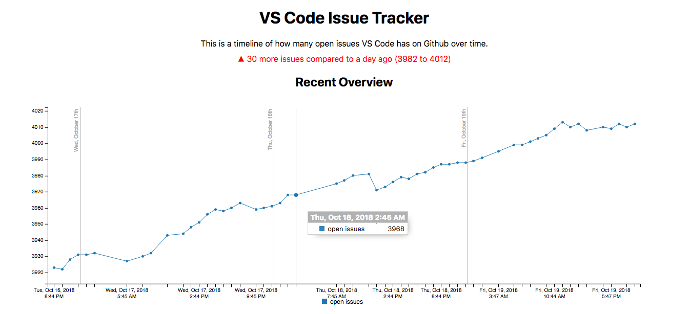

# VS Code Issue Tracker

The VS Code Issue Tracker is a visualization of the issue count on the [Microsoft/vscode](https://github.com/microsoft/vscode) repository over time.

The initial inspiration for this was to track the progress of [microsoft/vscode#58336](https://github.com/Microsoft/vscode/issues/58336).

You can visit the site live here: [vscode-issue-tracker.netlify.com](https://vscode-issue-tracker.netlify.com/)

# Webstack Description

The basis of the issue tracker is a serverless backend combined with a static frontend.

The backend consists of an AWS Lambda function which sends a query to the [Github V4 GraphQL API](https://developer.github.com/v4/) once an hour to see the current number of issues on the repository. That is stored in a [Cloud Firestore](https://firebase.google.com/docs/firestore/) database.

Then, I have a scheduled job to pull the last 3 days as well as last month of entries for the recent and monthly graphs. It saves these entries to a local JS file and commits it to the repo once an hour through Git.

Finally, I wrote a simple frontend using [C3.js](https://c3js.org/) to display the two graphs on a page. This is then committed to GitHub here and deployed to [Netlify](https://www.netlify.com/) across their Application Delivery Network.

Future plans include making this more generalized so anyone can spin up a very similar project with ease.
